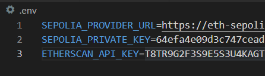

# Decentralized Comfort Center tutorial project

This project is a training project to learn the basics of developing smart contracts.

This documentation is meant to introduce various parts of the Ethereum ecosystem and its most common coding language, Solidity. You do not need to understand everything written here to be able to write smart contracts.

## What are smart contracts

Smart contracts are quite much like regular programs or applications except that they live and run on a blockchain.

They are not real legal contracts, but they have the power to force their programmed behaviour in a transparent manner. And that is their superpower: everyone can see what a contract does and knows that its behaviour is guaranteed forever.

## Introduction to Ethereum Virtual Machine (EVM) environment

### What is the Ethereum Virtual Machine (EVM)

The Ethereum Virtual Machine is an abstract computer which manages all the logic and consensus of the blockchain. It's the backbone of all the blockchain's operations: all addresses, contracts and state transitions are stored in the EVM.

The EVM is built by thousands of individual computers which participate in upholding the EVM's rules. Each one of these computers runs a *node client*, a program which knows the rules of the network and communicates with other node clients to propagate information, and to agree on the current blockchain's state.

#### Addresses

All interactions inside the blockchain happen between blockchain addresses. An address is a 40 character hexadecimal string (such as *0x7a250d5630B4cF539739dF2C5dAcb4c659F2488D*).

There are two types of addresses:
1. A user address. Also called an Externally Owned Address or EOA.
1. A contract address.

An EOA address is generated from the user's private key. A private key is generated randomly. So, to get an EOA, the user first generates a private key, which is then used to (deterministically) generate an EOA. This is also called a wallet or an account.

Every deployed contract has a unique contract address. Interaction with the contract happens to that address.

#### Transactions

Any interaction which changes state in the blockchain is called a transaction. Any time an EOA wants to interact with another EOA or a contract, they issue a transaction. Transactions are always issued by EOAs, so contracts can't issue transactions by themselves. Therefore, contracts can't also do anything on their own - all actions performed by contracts are always triggered by a transaction from an EOA.

It is possible to read data from the blockchain without a transaction. This kind of interaction only reads the data from the node you are connecting to, since all nodes contain the blockchain's current state. This kind of read-only interactions can't, obviously, change the state of the blockchain in any way.

### Ethereum assets

There are two types of assets in Ethereum. The main asset is the blockchain's native asset, called *Ether*. The other type is various user created assets, called tokens.

Ether is used for mainly two purposes: transfers of value (user or contract wants to transfer some asset of value to another user or contract) and for paying transaction costs. Transaction costs are explained below.

The other type, tokens, requires its own chapter and is explained a bit later.

### Transaction costs

Every transaction (including contract deployment) costs certain amount of *gas*. Gas is a unit for measuring computational complexity of operations. For example, multiplying two values in a contract costs a certain amount of gas, so the more operations (and more complex operations) your transaction performs in a contract, the more gas the transaction requires.

When writing contracts, one always has to consider the gas costs of each line of code.

To pay for your transaction's gas costs, you need to have Ethers in the wallet which issues the transaction. Ether is automatically used to pay for the gas costs. The eventual transaction cost depends not only on the transaction complexity, but also on the blockchain usage: the more usage the blockchain has, the more you have to pay to get your transaction processed.

Read-only interactions do not consume gas and are therefore free.

#### Tokens

Any user, with enough Ether to pay for the transaction costs, can write and deploy any contract. Since contracts can store state, they can be used as ledgers. Tokens are always regular smart contracts.

The most common token standard is the [ERC-20](https://ethereum.org/en/developers/docs/standards/tokens/erc-20/) token. The main element is a variable inside the contract which contains information about which address has which balance (this is the ledger). Furthermore, the token standard includes functions to change these balances by *transfers*. If the ledger says I have 5 tokens I can call the contract's transfer functionality to transfer those tokens to another address - this simply changes the numbers in the ledger, deducting from my balance and increasing the other address's balance.

Therefore, tokens are regular smart contracts which follow certain token standards. Since every ERC-20 token follows the same standard, it is easy to integrate the tokens to various other contracts.

Another famous token standard is the [ERC-721](https://ethereum.org/en/developers/docs/standards/tokens/erc-721/) standard - more commonly known by its name Non-Fungible Token, or NFT.

Many tokens have real world value. Therefore, they can be traded in various marketplaces and can be used to pay for various services.

## Solidity

### Why introduce Solidity

Nowadays there are many different languages for writing smart contracts. Solidity is, [by far](https://blog.chain.link/smart-contract-programming-languages/), the most popular language. It was arguably the first language for writing smart contracts since it was the first language for the first smart contract platform, Ethereum.

Because of its popularity, Solidity has good documentation and plenty of helpful articles around to help when stuck. Even [OpenAI](https://chat.openai.com/) understands and can help you with Solidity!

Therefore, we feel that Solidity is the natural choice for an introductory language.

### What is Solidity

Solidity is the original programming language for developing smart contracts for the Ethereum ecosystem. It has been inspired by JavaScript, so its syntax should look somewhat familiar.

Solidity is a high-level language and has lots of features familiar from other high-level languages. But since it is also a language for writing blockchain smart contracts, it has some unique extra features.

Before a Solidity contract can be used in a real blockchain environment, it needs to be compiled into a bytecode version. 

### Solidity development

#### Immutability

All deployed contracts are immutable. That means once a contract is deployed, nobody can change its code. Furthermore, all contracts are permanent: once it's deployed, it will stay in the blockchain forever.

However, contracts do have state, so their functionality can be changed by changing some variables. One just has to code all the desired logic in advance: if variable *x* equals zero it should do this, but if it's greater than zero do something else.

There are ways to "bypass" the immutability by using proxy contracts, but that's out of the scope for this tutorial.

#### Development tools

There exist various tools that help in contract development. Every developer has their favourite set of tools.

Probably the most used development environment is Visual Studio Code. This project has a [default extension recommendation](https://marketplace.visualstudio.com/items?itemName=NomicFoundation.hardhat-solidity) from Hardhat (set in folder *.vscode*).

For quick and easy playground in the browser, one can use [Remix](https://remix.ethereum.org/). It has good support for various tooling and some projects even use it for production code, but that's not recommended.

#### Example project files and folder structure

Let's use this project to explain what different folders are used for and what the files are. Let's go through the folders and files alphabetically:
- Folder *.vscode*: contains settings used in Visual Studio Code. For example extension recommendations. This is created by the developer.
- Folder *artifacts*: contains compiled Solidity bytecodes for all the used contracts. This is generated by Hardhat.
- Folder *assets*: contains images used in documentation. This is created by the developer.
- Folder *cache*: internal cache used by Hardhat. This is generated by Hardhat.
- Folder *contracts*: contains source code for all the used contracts. This is the default folder name used by Hardhat, but can be configured. this is created by the developer.
- Folder *node_modules*: contains all the used packages as listed in file *package.json*. This is generated by the package manager, NPM.
- Folder *scripts*: contains various scripts. Currently contains only the deployment script. This is created by the developer.
- Folder *test*: contains all the unit tests. This is the default folder name used by Hardhat (for its unit test tooling), but can be configured. This is created by the developer.
- Folder *typechain-types*: contains TypeScript definitions for all the used contracts. These can be used by your TypeScript code (unit tests and scripts mostly). This is generated by Hardhat.
- File *.env*: contains all the secret information required by the project, such as the deployer's private key. This is created by the developer.
- File *.env.example*: contains a template for to be used as the *.env* file. This is created by the developer.
- File *.gitignore*: contains list of files/folders which are not added to version control. This is created by the developer.
- File *hardhat.config.ts*: contains settings for Hardhat. This is created by the developer.
- File *package-lock.json*: contains information about used packages. This is generated by the package manager, NPM.
- File *package.json*: contains information about the project and the packages it requires. This is created by the developer.
- File *README.md*: contains all the documentation. This is created by the developer.
- File *tsconfig.json*: contains configuration for TypeScript. This is created by the developer.

#### Development pitfalls

As is the case with most modern coding languages, the language itself is not the difficult part to learn. Anyone can learn the language syntax and even most of the nuances.

The difficult part is understanding the environment in which the language is used. Since contracts are immutable it is not easy to fix possible issues - therefore the development lifecycle looks quite different than with traditional environments where often the business motto is "fail fast". If you fail fast with a blockchain smart contract, you may lose millions in real assets. Security has to be your development priority.

Another common pitfall is the contract's gas usage. Nobody wants to pay too much for their transactions. In the worst case, the contract becomes bricked if it tries to use more gas than any blockchain block has space for.

## Contract security

All programs have bugs. Smart contracts are no exception.

Bugs in smart contracts are a lot more serious for a few reasons:
1. Since contracts are immutable, there's no easy way to fix a bug
1. A contract may hold valuable assets. A bug may expose those to an attacker
1. The attack vectors are quite different compared to regular programs, which means specials skills and/or tools are required to identify security issues

### Security audits

Once a smart contract's code is ready, it is usually given to some auditing company for an audit.

These specialized auditing companies go through the contract code to try to identify security issues. They use a lot of static tooling, but the most important part is manually analyzing the contract. There is currently no real substitute for an expert human to manually go through the contract and report findings.

Once an audit is complete, a report is published and possible issues found in it are corrected. After that, big projects may start another audit with another company, or simply deem the contract ready for production and deploy it.

### Bug bounties

Since contract code is usually open sourced, anyone can go through it to find security issues. A special bug bounty program is sometimes issued where the contract team can pay a million dollars or [even more](https://assets.ctfassets.net/t3wqy70tc3bv/6Tqb2wlVnwdGYeVZX4WDmU/6b0c222b4f680ac80ea801e032894eac/Immunefi_Crypto_Bug_Bounty_and_Ransom_Payments_Report.pdf) for found critical issues.

## Example contract functionality

The contract presented in this repository (file *contracts/Voting.sol*) is a simple voting contract to distribute native assets sent to the contract. This is only created for learning purposes and is not meant to be used in real use.

The contract supports the following functionalities:
- A static list of voter addresses is provided to the contract upon deployment
- Voters can suggest a charity donation address
- At some point the voters vote whether the gathered assets should be sent to the target charity or not
- If enough voters agree, the assets can be distributed to the charity
- Anyone can send the blockchain's native asset to the contract to donate to the target charity

What is missing from this project:
- Resetting the vote state after the charity donation has been distributed
- Various supporting functionality, such a changing vote, withdrawing vote, abstain votes, ...

### Unit tests

Unit tests are small pieces of code which make sure certain specific functionality works in the smart contract. They help in making sure the contract works as intended, but also to help retain the desired functionality when changes are made to the contract.

The project contains comprehensive unit tests. The tests are written with Chai/Mocha JS test frameworks, with some Solidity-specific extensions.

### Used libraries and technologies

This project uses the following components:
- [Solidity](https://soliditylang.org/) language
- JavaScript, TypeScript
- [Hardhat](https://hardhat.org/) development environment
- Hardhat toolbox plugin, which includes the following notable packages:
  - [ethers.js](https://docs.ethers.org/v5/) Ethereum blockchain interaction library
  - [Mocka](https://mochajs.org/) and [Chai](https://chaijs.com/) JavaScript testing libraries
  - [Typechain](https://github.com/dethcrypto/TypeChain/) for creating TypeScript bindings for Solidity contracts

### Installation

1. Get the project's files from [GitHub](https://github.com/GoodCartel/SolidityTraining). Download as ZIP if you're not sure how to clone the repository itself
1. If not installed, [install node](https://nodejs.org/en/download)
1. Open a terminal in the project's root folder
1. Run `npm install`
1. To run unit tests, run `npx hardhat test`
1. For deployment, see below for details

## Deployment

### Deployment flow

Just having a ready source code (or bytecode) doesn't give you much - you also need to deploy it somewhere. You can think of deployment as similar to releasing a version of your traditional application, except that all blockchain deployments are permanent and immutable.

However, being permanent and immutable only refers to the blockchain in question. Nothing stops you from starting a new blockchain. And this is exactly what local development tools, including unit testing, do: they make it easy and fast to reset the blockchain state, essentially starting a new blockchain.

So when developing contracts on your local machine, you can (and should) utilize local blockchains which are easy to reset. Development tooling mostly handles this automatically in the background, but if needed you can also run a local blockchain explicitly.

Once you are ready to deploy your code to some real blockchain, which can't be reset, you should start by deploying to some test network blockchain. Each EVM blockchain, such as Ethereum, has one or more testnets which are meant for testing. You can get testnet Ethers for free, which you can then use for deployments and transactions. Testnets are good especially for collaborative testing: doing manual tests which require multiple parties, since multiple parties can't utilize your local blockchain.

After testnet, the next logical step is deploying to mainnet.

### Deploying the example contract

To deploy the example contract to the Sepolia testnet, you should:

1. Have an account (a wallet) with enough Ether for deployment
  1. To create an account, you can use a browser wallet extension. [Metamask](https://metamask.io/) is one popular wallet extension. Once you have it installed, you can switch network to Sepolia and create a new account.
  1. To get free Ether in the Sepolia testnet, you need a faucet. You can for example run this faucet for a while: https://sepolia-faucet.pk910.de/ . It takes a while to 'generate' Ether in order to deter spam attacks. Do note that this is not a real Proof of Work protocol.
1. Create a new file called `.env` in the project root folder. You can just duplicate the file `.env.example` to have a ready template. The `.env` file is a store for secret information. All information is represented as key-value pairs. See the attached image for an example on how it looks.
1. Export the created account's private key. Metamask offers this possibility through the account settings, instructions [here](https://support.metamask.io/hc/en-us/articles/360015289632-How-to-export-an-account-s-private-key). Add this private key to the `.env` file with the key `SEPOLIA_PRIVATE_KEY`. This private key is used to sign deployment transactions - so this account will be the one deploying contracts (and paying for the deployment).
1. Go to https://etherscan.io and create an Etherscan account there. Create an API key, export it and add it to `.env` with key `ETHERSCAN_API_KEY`. This is used to verify contracts in the Etherscan blockchain explorer.
1. Go to https://alchemy.com and create an Alchemy account. Create a new app in the Sepolia network. Export its full HTTPS url and add it to `.env` with key `SEPOLIA_PROVIDER_URL`. This is the blockchain connection provider you will use to connect to the blockchain.
1. Your `.env` file should now look like the image after these instructions.
1. Run command `npm run deploy` which executes a script `scripts/deploy.ts` for deployment and Etherscan verification.
1. It takes a bit more than a minute to deploy and verify, but once that's done the script should give you an address for the contract.

</img>Example of .env file contents

### Using the contract: user interfaces and integrations

Once a contract is deployed to some real blockchain (even testnet) there are two ways it can be utilized: through user interfaces or for other contracts to integrate with our contract.

For other contracts to connect to your contract, they need to have your contract's address and knowledge of the functionalities it supports. Contract address you get during deployment. To connect one contract to another, special contract types called *interfaces* are used. An interface simply lists contract functionality.

Typically, a contract has some sort of user interface built on top of it. This is often a website. The website utilizes [specialized libraries](https://docs.ethers.org) to interact with the blockchain through some *node provider* which provides access to the blockchain. The libraries makes it (relatively) easy for frontend developers to query contracts and to issue transactions to contracts.

#### Etherscan user interface

The Etherscan service generates a crude user interface for verified contracts. It's useful for performing some manual tests on a deployed contract and to read its state.

## Learn more

To continue learning about Solidity, smart contract and the EVM, you can try the following resources:

- A cool hands-on Solidity [tutorial](https://cryptozombies.io/). A bit outdated, but still works fine.
- The Ethereum Foundation's [Learn hub](https://ethereum.org/en/learn/)
- Consensys' [development recommendations](https://consensys.github.io/smart-contract-best-practices/development-recommendations)

## Contact information

TODO: hmm?
