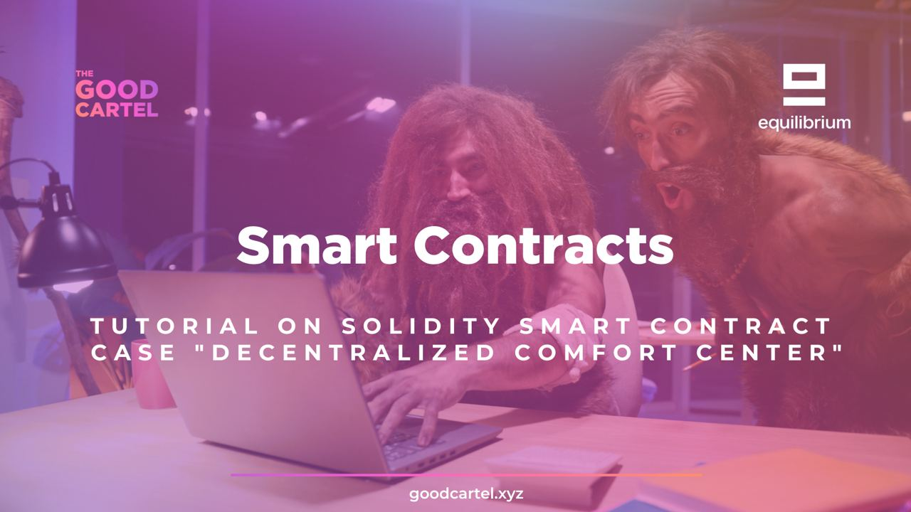

# Decentralized Comfort Center tutorial project

This project is a training project to learn the basics of developing smart contracts.

This documentation is meant to introduce various parts of the Ethereum ecosystem and its most common coding language, Solidity. You do not need to understand everything written here to be able to write smart contracts.

This document is divided into sub-documents to make reading easier.

## 1. Smart Contract Basics

[Basic information](/docs/basics.md) about smart contracts.

## 2. Introduction to Solidity and the Ethereum Virtual Machine (EVM) environment

Introduction to [Solidity and the Ethereum Virtual Machine](/docs/evm.md) environment.

## 3. Developing the contract - case Decentralized Comfort Center 

Decentralized Comfort Center [contract development](/docs/dev.md).

## 4. Learn more

To continue learning about Solidity, smart contract and the EVM, you can try the following resources:

- A cool hands-on Solidity [tutorial](https://cryptozombies.io/). A bit outdated, but still works fine.
- The Ethereum Foundation's [Learn hub](https://ethereum.org/en/learn/)
- Consensys' [development recommendations](https://consensys.github.io/smart-contract-best-practices/development-recommendations)

## Contact information

This documentation is part of a free Smart Contracts learning course by [Good Cartel](https://www.goodcartel.xyz) and [Equilibrium](https://equilibrium.co). You can find the course at the Good Cartel website.

For further questions, feel free to join the [Good Cartel Discord](https://discord.gg/PQvDBWxNG3).

</img>
